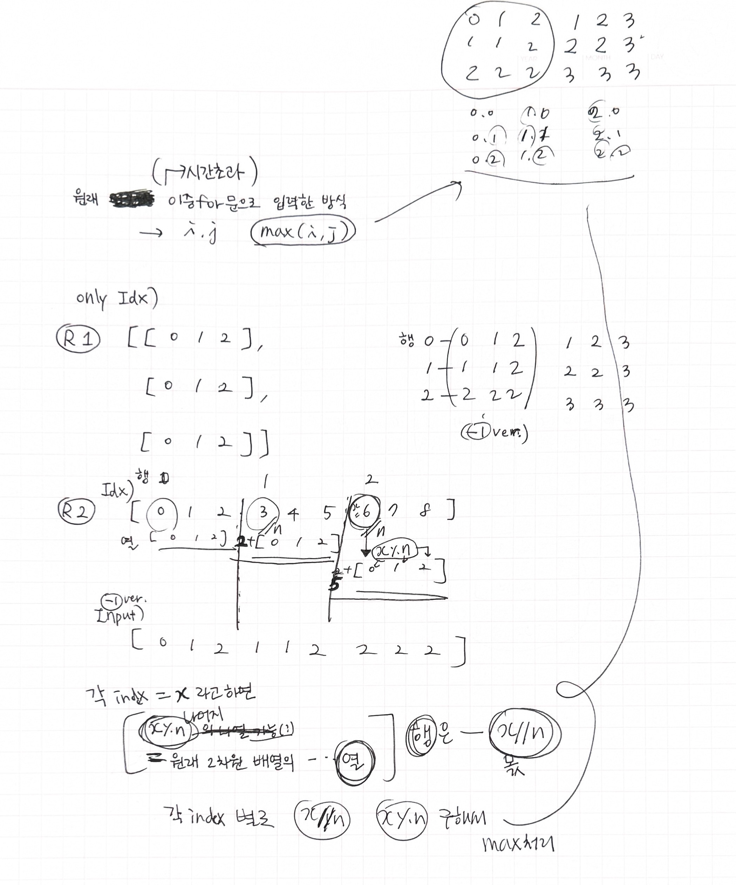

240622 am 01:44

#### n^2 배열 자르기

####

### 1st try

문제 순서대로 정직하게 풀었더니 시간 초과

```python
#1
arr = [[0] * n for _ in range(n)]

#2
for i in range(n):
    for j in range(n):
        arr[i][j] = max(i+1,j+1)
        # ... 생략
```

### 2 t

- 이중삼중 for문 쓰면 안 될 것 같고
- slice하고 append 하는 과정이 너무 복잡

- 노트에 끄적 .. 인덱스랑 비교해봄
  - max로 구했던 값들 Idx로 처리 가능<br>
    

```python
def solution(n, left, right):
    arr = []
    for i in range(n**2):
        arr.append(max(i // n + 1, i % n + 1))
    # arr = [0,1,2,1,1,2,2,2,2]

    answer = arr[left: right+1]
    return answer
```

그래도 시간 초과 ㅠ
<code>arr=[0] \* (n\*\*2)</code>로 바꿔도, append 안쓰고 값 입력해도 같음

### 3t

어디서 줄여야하지?????

- left, right 범위까지 지정?

### # pass

```python
# am 02:36
def solution(n, left, right):
    arr = []

    for i in range(left, right+1):
        arr.append(max(i // n + 1, i % n + 1))

    return arr
```

<br>
<hr>

### 다른 풀이 구경

1.  i // n, i % n 연산을 left, right에 먼저 해놓고 계산하는 방법도 있음

    ```python
    def solution(n, left, right):
        answer = []

        for row in range(left // n, right // n + 1):
            for col in range(n):
                if left <= row * n + col <= right:
                    answer.append(max(row, col) + 1)

        return answer
    ```

- n은 꽤 클수도 있다 <code>1 ≤ n ≤ 10^7</code>

  - 기본적으로 연산할 숫자 크기를 줄이는 작업이 중요 !

2. divmod를 사용한 풀이도 있음

   ```python
   # divmod(x, y) = (x // y, x % y)

   divmod(8, 3)  # (2, 2)
   ```
